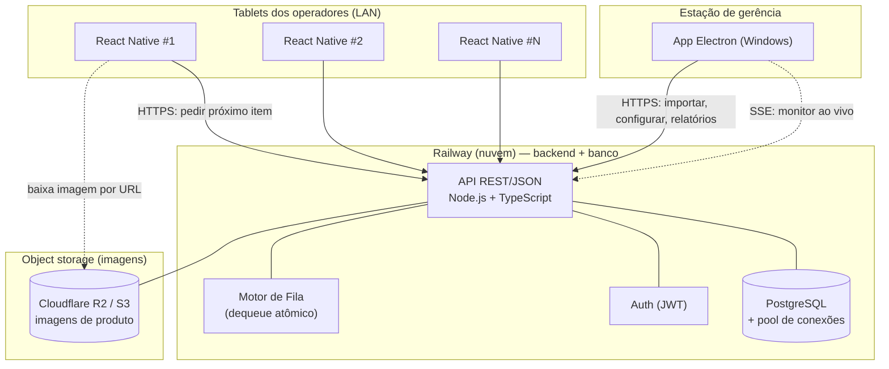

# Especificação Técnica — Sistema de Gestão de Fila de Produção

> Documento de requisitos e arquitetura para implementação via Claude Code.
> Toda a implementação deve seguir **TDD (Test-Driven Development)** e priorizar **eficiência de recursos** para uso contínuo e de alta concorrência.

---

## 0. Como usar este documento

Este é o "briefing" a ser entregue ao Claude Code. Ele está organizado para que a IA construa o projeto em fases, na ordem indicada na Seção 10. Antes de começar, **confirme as decisões em aberto da Seção 11** — elas alteram a arquitetura. Onde você não decidir, valem os *defaults* assumidos e marcados com `[ASSUMIDO]`.

---

## 1. Visão geral do produto

Sistema para gerenciar **filas de produção** em um chão de fábrica / linha de trabalho. Um administrador importa lotes de produtos (CSV/Excel) que viram itens de uma fila. Funcionários, cada um em um tablet, **puxam** o próximo item da fila sob demanda — **sem enxergar a fila inteira nem o próximo item**, apenas o que lhes é entregue. Todo trabalho é cronometrado (início/fim) e persistido para análise administrativa.

**Três aplicações + um núcleo:**

| Componente | Tecnologia | Usuário | Papel |
|---|---|---|---|
| App de Gerência | Electron (Windows) | Administrador | Importa arquivos, configura filas, monitora e analisa |
| App do Operador | React Native (tablet) | Funcionário | Faz login, puxa o próximo item, marca início/fim |
| Backend / "sistema inteligente" | Node.js + TypeScript | — | Autenticação, motor de fila, rastreamento, analytics |
| Banco de dados | PostgreSQL | — | Persistência transacional e base para relatórios |

---

## 2. Arquitetura



### 2.1 Princípios de arquitetura

1. **Modelo *pull* (sob demanda), não *push*.** O tablet só fala com o servidor quando o operador pede o próximo item ou marca conclusão. **Não há polling constante nem conexão persistente por tablet.** Isso é central para economizar recursos com muitos funcionários.
2. **Dequeue atômico é o coração do sistema.** Dois operadores nunca podem receber o mesmo item, mesmo pedindo no mesmo milissegundo. Resolvido com `SELECT ... FOR UPDATE SKIP LOCKED` no PostgreSQL (ver 5.1).
3. **Estado no servidor, apps "burros".** Os apps só renderizam e disparam ações; toda regra de negócio vive no backend, o que simplifica testes e mantém consistência.
4. **Contratos compartilhados.** Tipos/DTOs e validações (schemas) em um pacote TypeScript compartilhado entre backend, Electron e React Native, evitando divergência.
5. **Deploy em nuvem (Railway Hobby)** — apenas backend + PostgreSQL rodam na nuvem; os apps (Electron e React Native) são clientes que acessam a API por HTTPS. Como a comunicação agora atravessa a internet (não mais LAN), o modelo *pull* e o payload enxuto ficam **ainda mais importantes** para latência e custo. Imagens de produto **não** ficam no Postgres (limite de 5 GB) — vão para object storage (ver 2.2).
6. **Decisão registrada — fila no PostgreSQL, sem Redis.** O *dequeue* atômico via `SKIP LOCKED` já garante exclusão mútua sem contenção; introduzir Redis criaria uma segunda fonte de verdade (risco de item órfão), gastaria storage/serviço extra no Railway e não traz ganho no volume esperado (consumo humano, minutos por item). Redis só entra no futuro como *cache* de leitura ou *rate-limiting*, nunca como dono da fila. Ver Seção 13.

### 2.2 Stack tecnológica recomendada

- **Backend:** Node.js + TypeScript, framework **Fastify** (mais leve/rápido que Express, ótimo para alta taxa de requisições) ou NestJS se preferir estrutura opinativa. `[ASSUMIDO: Fastify]`
- **ORM/Query:** **Drizzle** ou **Prisma**. Para o dequeue atômico será usado SQL bruto/parametrizado (SKIP LOCKED), independentemente do ORM.
- **Banco:** PostgreSQL 16+.
- **Pool de conexões:** `pg-pool` no app, com `max` conservador por réplica de forma que (`max` × nº de réplicas) ≤ limite de conexões do Postgres do Railway. **PgBouncer é opcional nesse estágio** — só vale a pena (como serviço extra) se o nº de réplicas × conexões começar a estourar o limite; no volume esperado, o pool nativo basta.
- **Imagens de produto:** **object storage externo** (Cloudflare R2 — S3-compatível, faixa gratuita generosa e sem custo de egress; ou o storage do próprio Railway). No Postgres guarda-se **apenas a chave/URL**, nunca os bytes da imagem — o limite de 5 GB do plano Hobby não comporta imagens.
- **Auth:** JWT de acesso (curta duração) + *refresh token*; senhas com **Argon2id**.
- **Parsing de arquivos:** `csv-parse` (CSV) e `exceljs` ou `xlsx` (Excel).
- **Tempo real (monitor da gerência):** **SSE (Server-Sent Events)** — mais barato que WebSocket, unidirecional, suficiente para o dashboard. `[ASSUMIDO]`
- **Testes:** **Vitest** (backend e pacotes) + **Testcontainers** (PostgreSQL real em integração) + **React Native Testing Library** (tablet) + **Playwright/Electron** para e2e do desktop.
- **Empacotamento:** deploy do backend no Railway (Dockerfile ou buildpack) com Postgres gerenciado do Railway; `electron-builder` para o Windows; EAS/Metro para o React Native. Docker Compose local só para desenvolvimento/testes.

### 2.3 Estrutura de monorepo sugerida

```
/apps
  /server        (Fastify + TS: API, motor de fila, auth, analytics)
  /desktop       (Electron + React: app de gerência)
  /tablet        (React Native: app do operador)
/packages
  /contracts     (tipos, DTOs, schemas Zod compartilhados)
  /db            (schema, migrations, seed)
/infra
  docker-compose.yml, PgBouncer, scripts de backup
```

Gerenciador: **pnpm workspaces** + **Turborepo** (cache de build/test — economiza tempo em CI e nas iterações do Claude Code).

---

## 3. Papéis e permissões

| Papel | Pode |
|---|---|
| **Admin** | Importar arquivos; criar/editar filas e regras de prioridade; criar/desativar operadores; ver monitor ao vivo; ver todos os relatórios; requeue manual; cancelar itens |
| **Operador** | Fazer login no tablet; pedir o próximo item; marcar início (automático) e conclusão; reportar problema em um item; ver **apenas** o item atual e o próprio histórico do turno |

Regra rígida: **o operador nunca recebe do servidor a lista da fila nem qualquer dado do "próximo" item**. A API do operador expõe somente o item atualmente atribuído a ele.

---

## 4. Modelo de dados (PostgreSQL)

> Nomes de tabela em inglês para consistência de código; ajuste se preferir.

**users**
- `id` (uuid, pk)
- `username` (text, único)
- `password_hash` (text, Argon2id)
- `role` (enum: `admin` | `operator`)
- `display_name` (text)
- `is_active` (bool, default true)
- `created_at`, `updated_at`

**import_batches** — cada arquivo importado
- `id` (uuid, pk)
- `filename` (text)
- `source_type` (enum: `csv` | `xlsx`)
- `imported_by` (fk users)
- `column_mapping` (jsonb — mapeamento coluna→campo)
- `total_items` (int)
- `valid_items` (int), `rejected_items` (int)
- `status` (enum: `processing` | `ready` | `failed`)
- `created_at`

**queue_items** — cada produto a ser trabalhado
- `id` (uuid, pk)
- `batch_id` (fk import_batches)
- `external_ref` (text — código/SKU do produto vindo do arquivo)
- `product_id` (uuid, fk products, **nulo** até ser vinculado — ver 4.1)
- `payload` (jsonb — dados do produto que o operador verá)
- `priority` (int, default 0 — maior = mais urgente)
- `sequence` (bigserial — ordem de chegada, desempate FIFO)
- `status` (enum: `pending` | `in_progress` | `completed` | `cancelled` | `problem`)
- `created_at`, `updated_at`
- **Índice crítico:** `(status, priority DESC, sequence ASC)` para o dequeue.

**work_logs** — registro de trabalho (o que a gerência analisa)
- `id` (uuid, pk)
- `queue_item_id` (fk queue_items)
- `operator_id` (fk users)
- `started_at` (timestamptz)
- `completed_at` (timestamptz, nulo enquanto em andamento)
- `duration_seconds` (int, calculado na conclusão)
- `outcome` (enum: `completed` | `abandoned` | `problem`)
- `problem_note` (text, opcional)
- **Índices:** `(operator_id, started_at)`, `(queue_item_id)`.

**work_sessions** *(opcional, para turnos)* — login/logout do operador para relatório de presença.

Regra de integridade: um `queue_item` só pode ter **um** `work_log` ativo (sem `completed_at`) por vez. Um operador só pode ter **um** item `in_progress` por vez.

### 4.1 Catálogo de produtos e imagens (tabelas adicionais)

O catálogo é o cadastro-mestre de produtos, mantido pela gerência. Itens que chegam nos pedidos (`queue_items`) são **vinculados** a um produto do catálogo para que o operador veja detalhes e imagens. Ver o fluxo de vinculação em 4.2 e o módulo na Seção 7.

**products** — cadastro-mestre
- `id` (uuid, pk)
- `sku` (text, único — chave usada para casar com `queue_items.external_ref`)
- `name` (text)
- `description` (text)
- `attributes` (jsonb — especificações livres: cor, tamanho, instruções de montagem etc.)
- `is_active` (bool)
- `created_by` (fk users), `created_at`, `updated_at`
- **Índice:** `(sku)`.

**product_images** — imagens de cada produto (arquivos ficam no object storage; aqui só metadados)
- `id` (uuid, pk)
- `product_id` (fk products)
- `storage_key` (text — chave do objeto no R2/S3)
- `url` (text — URL pública ou assinada para o app baixar)
- `position` (int — ordem de exibição)
- `created_at`

### 4.2 Vinculação produto ↔ item do pedido

O `external_ref` de cada `queue_item` (código vindo do CSV/Excel) é casado com `products.sku`:

- **Automático:** na confirmação de uma importação, casar por `sku` exato. Onde casar, preencher `queue_items.product_id`.
- **Manual (gerência):** itens sem correspondência ficam com `product_id = null` e aparecem numa tela de **reconciliação** no Electron, com sugestões por similaridade (fuzzy) para o admin vincular com um clique — ou cadastrar um produto novo na hora.
- **Herança de dados:** quando um item está vinculado, o operador recebe `name`, `description`, `attributes` e as URLs das imagens do produto (não só o `payload` cru do arquivo). Sem vínculo, recebe apenas o `payload`, e o app pode sinalizar "produto sem cadastro".

---

## 5. Regras de negócio críticas

### 5.1 Dequeue atômico (o item mais importante do sistema)

Quando um operador pede o próximo item, em **uma única transação**:

```sql
-- pseudo; parametrizar operator_id
WITH next AS (
  SELECT id
  FROM queue_items
  WHERE status = 'pending'
  ORDER BY priority DESC, sequence ASC
  FOR UPDATE SKIP LOCKED
  LIMIT 1
)
UPDATE queue_items q
SET status = 'in_progress', updated_at = now()
FROM next
WHERE q.id = next.id
RETURNING q.*;
```

Em seguida, na mesma transação, inserir `work_logs` com `started_at = now()`. `SKIP LOCKED` garante que dois operadores concorrentes peguem itens **diferentes** sem bloqueio/espera.

**Se a fila estiver vazia:** retornar resposta clara `{ available: false }` — o app mostra "Sem trabalho disponível no momento".

### 5.2 Abandono / perda de conexão

Um item `in_progress` cuja atividade excede um **timeout configurável** (ex.: sem *heartbeat*/conclusão em N minutos) é automaticamente devolvido: `work_log.outcome = 'abandoned'`, `queue_item.status = 'pending'`. Isso evita itens "presos" quando um tablet cai. Implementar como *job* periódico no servidor (ex.: a cada minuto).

### 5.3 Conclusão

Ao marcar concluído: setar `completed_at`, `duration_seconds = completed_at - started_at`, `outcome = 'completed'`, `queue_item.status = 'completed'`. Só é permitido concluir o item que está atribuído ao operador autenticado.

### 5.4 Prioridade ("inteligência" da fila)

O motor ordena por `priority DESC, sequence ASC`. A prioridade pode vir do arquivo importado, de uma regra por tipo de produto, ou por prazo. `[ASSUMIDO: começar com prioridade numérica + FIFO; roteamento por habilidade do operador fica como extensão futura — ver 11.]`

### 5.5 Reportar problema

O operador pode marcar o item atual como `problem` (com nota). O item sai da fila normal e aparece no painel da gerência para tratamento manual.

---

## 6. Funcionalidades — Backend / API

Endpoints em REST/JSON. Todos autenticados via JWT, exceto login. Validar entrada com Zod (schemas no pacote `contracts`).

### 6.1 Autenticação
- `POST /auth/login` → credenciais → `{ accessToken, refreshToken, user }`
- `POST /auth/refresh`
- `POST /auth/logout`

### 6.2 Importação (admin)
- `POST /imports` (multipart) → recebe CSV/Excel, detecta colunas, retorna **preview** e sugestão de mapeamento sem persistir ainda.
- `POST /imports/:id/confirm` → com `column_mapping` confirmado → valida linhas, cria `queue_items`, marca linhas rejeitadas com motivo.
- `GET /imports` / `GET /imports/:id` → status e estatísticas do lote.

### 6.3 Fila (operador)
- `POST /queue/next` → **dequeue atômico** (5.1); retorna item ou `{ available: false }`.
- `POST /queue/items/:id/complete` → conclui (5.3).
- `POST /queue/items/:id/problem` → reporta problema (5.5).
- `POST /queue/items/:id/heartbeat` → sinal de vida opcional para o controle de abandono.
- `GET /queue/current` → item atualmente atribuído ao operador (para reidratar a tela após reabrir o app).

### 6.4 Gerência de fila (admin)
- `GET /admin/queue?status=&batch=` → visão administrativa (admin **pode** ver tudo; operador **não**).
- `POST /admin/queue/items/:id/requeue` / `/cancel`.
- `PUT /admin/queue/rules` → regras de prioridade.

### 6.5 Usuários (admin)
- `POST /admin/users`, `GET /admin/users`, `PUT /admin/users/:id` (desativar, resetar senha).

### 6.6 Analytics e relatório de desempenho (admin)
- `GET /admin/analytics/by-operator?from=&to=` → itens/operador, tempo total, tempo médio por item, taxa de conclusão.
- `GET /admin/analytics/by-product?from=&to=` → volume e tempo por produto.
- `GET /admin/analytics/throughput?from=&to=&bucket=hour|day` → itens concluídos por período.
- `GET /admin/reports/operator/:id?from=&to=` → **relatório de desempenho individual** (ver 6.6.1).
- `GET /admin/analytics/export?format=csv|xlsx&report=` → exportação para planilha.
- Todos os agregados devem ser feitos em **SQL** (GROUP BY), não em memória.

#### 6.6.1 Relatório de desempenho por funcionário `[EM ABERTO — refinar métricas]`

Base: `work_logs` já contém tudo (operador, produto, início, fim, duração, desfecho). Métricas sugeridas por operador, num período:
- **Volume:** itens concluídos, em andamento, abandonados, com problema.
- **Tempo:** tempo ativo total, tempo médio por item, e — importante — **tempo médio por produto** (não só média geral).
- **Qualidade/consistência:** taxa de conclusão (concluídos ÷ atribuídos), taxa de problemas, taxa de abandono.
- **Ritmo:** itens/hora ao longo do turno; tempo ocioso entre itens (gap entre `completed_at` de um e `started_at` do próximo).
- **Evolução:** série temporal do desempenho por dia/semana.
- **Ranking comparativo** entre operadores.

> **Cuidado de justiça na avaliação:** produtos diferentes levam tempos diferentes. Comparar operadores por contagem bruta pune quem pega itens mais complexos. O relatório deve comparar **por tipo de produto** (tempo do operador X no produto Y vs. média da equipe no produto Y), não só totais. Vale deixar isso explícito para o Claude Code.

### 6.7 Catálogo de produtos e vinculação (admin)
- `POST /admin/products`, `GET /admin/products?search=`, `PUT /admin/products/:id`, `DELETE /admin/products/:id` (soft delete via `is_active`).
- `POST /admin/products/:id/images` (multipart) → sobe imagem ao object storage, grava metadados em `product_images`; `DELETE /admin/products/:id/images/:imageId`.
- `POST /admin/imports/:id/link` → dispara a vinculação automática por `sku` para o lote (preenche `product_id` onde casar).
- `GET /admin/imports/:id/unlinked` → itens do lote sem vínculo, com sugestões *fuzzy*.
- `POST /admin/queue/items/:id/link` → vínculo manual de um item a um `product_id`.

### 6.8 Monitor ao vivo (admin)
- `GET /admin/stream` (SSE) → eventos de: item atribuído, item concluído, operador entrou/saiu, tamanho da fila. O dashboard consome esse fluxo.

---

## 7. Funcionalidades — App de Gerência (Electron/Windows)

1. **Login de admin.**
2. **Importar arquivo:** arrastar CSV/Excel → tela de mapeamento de colunas (coluna do arquivo → campo do sistema: `external_ref`, `priority`, campos de `payload`) → **preview** com contagem de linhas válidas/rejeitadas → confirmar. Mostrar erros de validação por linha.
3. **Filas e prioridade:** listar lotes, ver itens por status, editar regras de prioridade, requeue/cancelar itens, tratar itens marcados como `problem`.
4. **Catálogo de produtos:** cadastrar/editar produtos (SKU, nome, descrição, atributos) e **subir imagens** (enviadas ao object storage). Buscar e gerenciar o catálogo.
5. **Vinculação (reconciliação):** após importar, ver o resultado do casamento automático por SKU; para itens sem vínculo, uma tela lista os pendentes com **sugestões por similaridade** para vincular com um clique ou cadastrar produto novo na hora.
6. **Monitor ao vivo (dashboard):** quem está trabalhando em quê agora, tamanho da fila, itens/hora, alertas de abandono. Alimentado por SSE.
7. **Relatórios/analytics:** por operador, por produto, por período; **relatório de desempenho individual** (Seção 6.6.1) com comparação justa por tipo de produto; gráficos e **exportar para Excel/CSV**.
8. **Gestão de operadores:** criar login, definir nome, desativar, resetar senha.

Diretriz de UI (Electron): interface densa e funcional para desktop; usar a skill de *frontend-design* na implementação para evitar visual "template".

---

## 8. Funcionalidades — App do Operador (React Native/tablet)

1. **Login** (usuário + senha; token guardado com segurança no dispositivo).
2. **Tela principal:** um botão grande **"Pegar próximo item"**. Nada da fila é exibido.
3. **Tela do item:** ao receber, mostra os dados de forma clara para chão de fábrica (fontes grandes, alto contraste). Se o item estiver **vinculado a um produto do catálogo**, exibe nome, descrição, atributos e as **imagens** (baixadas por URL do object storage, com cache local para não rebaixar a cada vez); se não, mostra apenas o `payload` cru e sinaliza "produto sem cadastro". O cronômetro de trabalho inicia automaticamente (`started_at` no servidor).
4. **Ações no item:** **"Concluir"** e **"Reportar problema"** (com nota).
5. **Reidratação:** ao reabrir o app, chamar `GET /queue/current` para retomar o item em andamento (evita perder trabalho após fechar o app).
6. **Resiliência de conexão:** se a conclusão falhar por rede, enfileirar localmente o evento e reenviar (idempotência via `queue_item_id` + estado). Evitar dupla-conclusão.
7. **Fim de turno / logout.**
8. **Estado "sem trabalho":** exibir mensagem quando `{ available: false }`.

Diretriz de UX: pensado para uso rápido e repetitivo, com poucos toques, tolerante a mãos ocupadas/luvas.

---

## 9. Requisitos não-funcionais e otimização de recursos

Estes requisitos são **obrigatórios** por causa do uso contínuo e de muitas consultas:

1. **Modelo pull + sem conexões persistentes por tablet** (só SSE para a *única* estação de gerência) — ainda mais crítico agora que o tráfego passa pela internet, não pela LAN.
2. **Pool de conexões dimensionado ao Railway:** (`max` por réplica × nº de réplicas) ≤ limite de conexões do Postgres do Railway. PgBouncer só se o limite apertar.
3. **Índices corretos** (Seção 4), especialmente o composto para o dequeue; validar com `EXPLAIN ANALYZE`.
4. **`SELECT ... FOR UPDATE SKIP LOCKED`** para concorrência sem contenção de lock.
5. **Paginação** obrigatória em toda listagem administrativa; nunca retornar tabelas inteiras.
6. **Agregações em SQL** (GROUP BY), com possibilidade de *materialized views* para relatórios pesados se necessário.
7. **Payload de resposta enxuto** para o operador (só o item atual); imagens servidas direto do object storage por URL, não trafegam pela API.
8. **Storage sob controle (limite de 5 GB no Railway):** imagens vão para object storage externo; o Postgres guarda só metadados. Monitorar o crescimento das tabelas e arquivar lotes antigos se necessário.
9. **Cache de leitura** apenas onde seguro (ex.: regras de prioridade, catálogo), nunca no caminho do dequeue.
10. **Observabilidade leve:** logs estruturados (pino) e métricas básicas (tamanho da fila, latência do dequeue, itens/min).
11. **Backup** do Postgres (o Railway oferece backups do banco gerenciado; documentar e testar restauração).
12. **Configuração por variáveis de ambiente** (timeouts, TTL de token, string de conexão, credenciais do object storage), nada hardcoded.
13. **Custo Railway:** manter poucos serviços (backend + Postgres), evitar réplicas ociosas e trabalhos que rodem à toa; o job de abandono deve ser leve e com intervalo razoável.

Metas de desempenho sugeridas (ajuste conforme o volume real): dequeue < 50 ms sob concorrência de 50 operadores; nenhum item jamais atribuído a dois operadores (garantido por teste — ver 10).

---

## 10. Estratégia de TDD (obrigatória) e ordem de implementação

**Regra geral:** todo comportamento nasce de um teste que falha (red) → implementação mínima (green) → refatoração (refactor). Nenhuma funcionalidade entra sem teste. Cobertura mínima sugerida: **90% no backend**, com foco em ramos de decisão.

**Pirâmide de testes:**
- *Unit:* parsing de CSV/Excel, validação de linhas, cálculo de duração, ordenação de prioridade.
- *Integração (com PostgreSQL real via Testcontainers):* dequeue, conclusão, abandono, analytics.
- *E2E:* fluxo do operador (login → pegar → concluir) no RN; fluxo de importação no Electron.

**Teste-carro-chefe (exigir explicitamente):** teste de **concorrência do dequeue** — disparar N pedidos simultâneos e afirmar que cada `queue_item` foi atribuído a **exatamente um** operador e que não sobrou item pendente indevidamente. Este teste protege a correção do sistema inteiro.

### Ordem sugerida para o Claude Code (implementar fase a fase, cada uma com testes primeiro):

1. **Fundação:** monorepo (pnpm+Turborepo), `packages/contracts` (schemas Zod + tipos), `packages/db` (schema + migrations), Docker Compose local (Postgres) para desenvolvimento/testes. *Teste:* migrations sobem e schema bate.
2. **Auth:** login/refresh/logout, Argon2id, RBAC. *Testes* de unidade e integração.
3. **Motor de fila:** dequeue atômico + conclusão + abandono (job). *Inclui o teste de concorrência.*
4. **Importação:** preview, mapeamento de colunas, validação, criação de itens. *Testes* com arquivos-fixture CSV e XLSX.
5. **Catálogo + vinculação:** CRUD de produtos, upload de imagens ao object storage, vinculação automática por SKU e manual (reconciliação). *Testes* de casamento automático e de herança de dados para o item.
6. **Analytics + relatório de desempenho + SSE.** *Testes* de agregação em SQL, incluindo comparação por tipo de produto.
7. **App do operador (React Native):** login, pegar/concluir/problema, exibição de produto+imagens, reidratação, resiliência offline. *Testes* de componente e e2e do fluxo feliz.
8. **App de gerência (Electron):** importação, reconciliação/vinculação, catálogo, monitor ao vivo, relatórios, gestão de operadores. *Testes* e2e dos fluxos principais.
9. **Deploy Railway + infra final:** configurar backend + Postgres no Railway, variáveis de ambiente, object storage, backups; empacotar Electron (electron-builder) e build do RN; documentar deploy.

Peça ao Claude Code para, ao fim de cada fase, rodar toda a suíte e reportar cobertura antes de avançar.

---

## 11. Decisões em aberto (confirme antes de enviar ao Claude Code)

Estas escolhas mudam a arquitetura. Onde não decidir, valem os `[ASSUMIDO]` acima.

1. **Escala real:** quantos operadores/tablets simultâneos e quantos itens/dia? Define dimensionamento do pool no Railway e necessidade (ou não) de materialized views/réplicas. R: Serão no máximo 50 operadores usando tablets, de segunda a sexta.
2. **Estratégia de imagens:** confirmar Cloudflare R2 (recomendado, faixa gratuita e sem egress) vs. storage do Railway. Definir tamanho/quantidade máx. de imagens por produto e se as URLs serão públicas ou assinadas. - R: Deixar em aberto, abstrair camada de comunicação para poder ser implementado o serviço depois
3. **Regras de vinculação:** o casamento é sempre por `sku` exato? Existe caso de um item do pedido mapear para mais de um produto, ou variações (tamanho/cor) do mesmo SKU? Isso muda o modelo de dados. R: vamos pensar em algo melhor, pois tenho 3 fontes de dados diferentes, então podemos ver um jeito de ao cadastrar produtos, vincular skus a ele para quando subir os csvs.
4. **Métricas do relatório de desempenho:** quais indicadores realmente importam para você avaliar (produtividade, qualidade, pontualidade)? E a comparação deve ser por tipo de produto para ser justa — confirmar. - R: quero ver os 3 indicadores citados, e opção de ver geral e por produto
5. **"Inteligência" da fila:** apenas prioridade+FIFO, ou roteamento por habilidade/tipo de produto por operador, balanceamento de carga, ou prazos? Comecei simples e deixei roteamento como extensão. - R: se possível, deixar flexível a definição de ordem de prioridade para que o admin consiga mexer nisso
6. **Colunas dos arquivos:** exemplos reais de CSV/Excel ajudam a definir o mapeamento e as validações. Anexe amostras ao pedido do Claude Code. - R: no momento, imagine que vc irá receber uma planilha estruturada, e que tem um campo dizendo qual é a fonte, por exemplo: mercado livre, shopee, ebay. Sendo essa mesma ordem de prioridade que deve ser produzida
7. **Operação offline no tablet:** com backend na nuvem, quedas de internet no chão de fábrica são mais prováveis. O plano cobre resiliência a quedas curtas; se precisar de operação offline prolongada, o modelo muda (sincronização). - R: não acho que seja necessário modo offline no momento, pode seguir pensando em uma internet estável
8. **Turnos/presença:** precisa de relatório de presença por turno (login/logout), ou só tempo por item? - R: pode aplicar por enquanto somente o de tempo por item
9. **Idioma da interface / fuso horário** para os relatórios. - R: tudo deve estar em portugues do brasil, e intuitivo ao usuário

---

## 12. Resumo do pedido a ser feito ao Claude Code

> "Implemente o sistema descrito nesta especificação, em um monorepo pnpm+Turborepo com `apps/server` (Fastify+TS), `apps/desktop` (Electron), `apps/tablet` (React Native) e `packages/contracts` e `packages/db`. Use **PostgreSQL como fila** com dequeue atômico via `FOR UPDATE SKIP LOCKED` (sem Redis — ver Seção 13). Backend e Postgres rodam no **Railway (plano Hobby)**; imagens de produto vão para **object storage externo**, nunca no banco. Inclua o **catálogo de produtos com vinculação** ao pedido (Seção 4.1/4.2/6.7) e o **relatório de desempenho por funcionário** (6.6.1). Siga **estritamente TDD** (red-green-refactor), implementando na ordem da Seção 10, começando pelo teste de concorrência do dequeue como caso central. Priorize eficiência de recursos conforme a Seção 9. Ao fim de cada fase, rode a suíte e reporte cobertura."

---